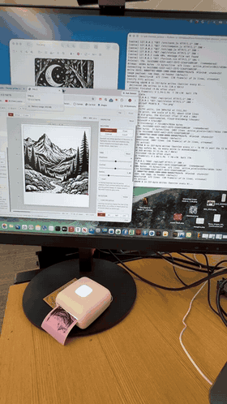

# tp6s-mac

Print from a Mac to a Vretti TP6-S pocket thermal printer — smoothly,
losslessly, without the vendor app.

<p align="center">
  <a href="media/tp6s-demo.mp4">
    
  </a>
</p>

<p align="center"><sub>A full-width image going out over Bluetooth — <a href="media/tp6s-demo.mp4">watch the whole print</a>.</sub></p>

The TP6-S is a 300 dpi, 58 mm Bluetooth pocket printer, normally locked to
the "xlife-pro" phone app. The same printer is resold under LFPERT, VOZY and
Xprinter names. If yours advertises as `TP6` over Bluetooth, this talks to
it.

Requires macOS, an internet connection for first-time setup, and Python 3.10
or newer. The no-Python Web Bluetooth fallback needs Chrome or Edge.

Tested on macOS 26.5.2, Apple silicon, with Python 3.14.6. Other current Macs
should work, but that is the environment this release has actually exercised.

## Install

```bash
git clone https://github.com/elwinloomis/tp6s-mac.git
cd tp6s-mac
./tp6 gui
```

The first run creates a private Python environment and installs the pinned
runtime dependencies. Allow Bluetooth when macOS asks. Turn the printer on,
compose in the page that opens, hit Print.

For a smaller first test, verify discovery and print one line:

```bash
./tp6 scan
./tp6 print "Hello"
```

Optional, to print from any Mac app's print dialog:

```bash
./tools/install_pdf_service.sh
```

That installs the optional Quartz dependency and adds **Send to TP6-S** to
the PDF menu of every print dialog.

## What gets installed, and where

Nothing goes into system locations, and nothing goes into this folder:

- `~/.venvs/tp6s` — a Python venv with `bleak` and Pillow. The optional PDF
  Service installer adds `pyobjc-framework-Quartz`. `./tp6` uses this venv;
  `./setup.sh` repairs it. Delete the directory to uninstall.
- `~/.config/tp6s/` — remembers your printer, so warm prints skip the scan
  (1.2 s from command to motor). `./tp6 forget` clears it.
- `~/Library/PDF Services/Send to TP6-S` — the print-dialog item, only if
  you ran the installer. `./tools/install_pdf_service.sh --uninstall`
  removes it.

## Use

**The browser tool** — `./tp6 gui`. Quote cards, images with four halftones,
text, or a free-form page of pictures and type. Print sends it through the
fast path. No pairing, no connect button: each job finds the printer, prints,
and lets go.

**The command line:**

```bash
./tp6 print "Hello"        # text
./tp6 image photo.png      # image, dithered to 576 px wide
./tp6 feed 32              # advance paper
./tp6 scan                 # list Bluetooth devices, for diagnosis
```

**The print dialog** — in any app: **File ▸ Print… ▸ PDF ▾ ▸ Send to
TP6-S**. Margins are trimmed, pages stacked, threshold or dither chosen per
page. `./tp6 gui` (or `./tp6 serve`) must be running. There is no progress
bar; every outcome arrives as a notification.

**No Python at all** — open `web/tp6s.html` in Chrome or Edge and print over
Web Bluetooth. It works but stutters. It is the fallback.

## How it works

| Path | Measured throughput |
|---|---|
| Chrome Web Bluetooth | 1.74 KB/s |
| Python + bleak, streamed with a barrier | 11 KB/s |
| **What the printer eats** | **~6 KB/s** |

Deliver under ~6 KB/s and the motor stops and starts; the print bands.
Deliver too far over it and the printer's buffer silently overflows; a strip
vanishes from the middle of the page. This toolkit streams each job as one
buffer with periodic write barriers — the narrow path between those — and
above ~1,000 lines it slows to the printer's own pace, because a stutter you
can see beats a hole you cannot.

## Getting good prints

- Compose at 576 px wide. The head is 576 dots across 48 mm. Browser and image
  pages follow a roll rather than a fixed sheet; PDF Service jobs are capped
  at 12,000 dot-lines (about one metre).
- Thermal bloom eats thin strokes. Bold faces survive. So do deliberately
  rough ones — typewriter, woodcut. Refined text faces at regular weight do
  not.
- For AI art: ask for high-contrast woodcut or linocut at 948×1659 px and
  print with `--nodither`. `fox.png` is the proof.

## Documentation

- `ARCHITECTURE.md` — the supported paths, transport rules and safety
  invariants.
- `INVESTIGATION.md` — reproducible measurements behind the transport and
  raster choices.
- `web/README.md` — a concise guide to the browser application's structure.
- `research/` — unsupported measurement and protocol-discovery utilities.
- `HOW-THIS-WAS-BUILT.md` — a short note on the human/agent collaboration.
- `CONTRIBUTING.md` — extension points, checks and hardware-test expectations.

## Troubleshooting

- **No printer found:** charge and power on the printer, then close the phone
  app and any browser tab connected through Web Bluetooth. The printer accepts
  one Bluetooth link and stops advertising while another client holds it.
- **A remembered printer stopped working:** run `./tp6 forget`, then
  `./tp6 scan` to discover it again.
- **Bluetooth was denied:** enable Bluetooth for your terminal application in
  **System Settings ▸ Privacy & Security ▸ Bluetooth**, then restart the
  terminal and retry.
- **The GUI opened in the wrong browser:** copy the printed
  `http://127.0.0.1:8776/` URL into Chrome or Edge. `./tp6 gui` asks macOS to
  open the default browser and cannot choose it for you.
- **The print-dialog item does nothing:** start `./tp6 gui` first. Detailed
  helper output remains visible in that terminal. Wrapper messages can be
  inspected with:

  ```bash
  log show --last 30m --predicate 'eventMessage CONTAINS "TP6S:"' --style compact
  ```
- **Setup failed:** run `./setup.sh` directly for the complete error. PDF
  dependency problems can be isolated with `./setup.sh --pdf`.

## Credit

This started as a fork of
[Thaolia/tp6-thermal_printer](https://github.com/Thaolia/tp6-thermal_printer)
(MIT), whose reverse-engineering of the CUS protocol everything here is
built on. Their
[`docs/PROTOCOL.md`](https://github.com/Thaolia/tp6-thermal_printer/blob/main/docs/PROTOCOL.md)
is the protocol reference; this project is the macOS toolkit. Additional
measured interoperability findings are recorded in `INVESTIGATION.md`.

Built with [Claude Code](https://claude.com/claude-code). Hardware findings
were checked on paper; `INVESTIGATION.md` records the reproducible evidence.

## License

MIT — `LICENSE` carries both copyright lines. No vendor code is included;
the protocol facts come from interoperability reverse-engineering.
